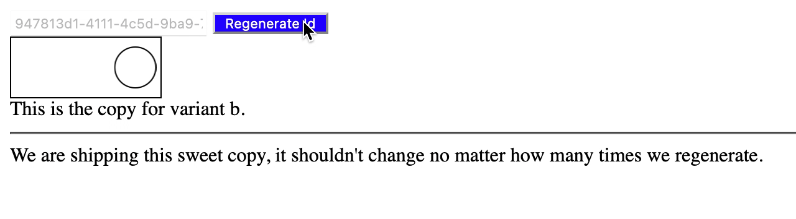

# ablab [](https://github.com/rcasto/ablab/actions/workflows/main-branch.yml)
A simple library for enabling experimentation.

This library primarily offers experiment bucketing and defines a schema for experiments using a JSON based config.



## Usage
```javascript
import { createExperimenter } from 'ablab';

const experimentConfig = {
    "changing the button color": {
        variations: {
            treatment: {
                traffic: 50,
                data: {
                    color: "yellow",
                    textColor: "black"
                }
            },
            control: {
                traffic: 50,
                data: {
                    color: "blue",
                    textColor: "white"
                }
            }
        }
    },
    "make the animation slower": {
        variations: {
            treatment: {
                traffic: 50
            },
            control: {
                traffic: 50
            }
        }
    }
};

const experimenter = createExperimenter(experimentConfig);
const buttonColorExperimentAssignment = experimenter.getVariationForExperiment('changing the button color', 'unique-id');
const uniqueIdVariationAssignments = experimenter.getVariationsForUniqueId('unique-id');

console.log(JSON.stringify(uniqueIdVariationAssignments, null, '\t'));
/**
{
	"changing the button color": {
		"variationName": "control",
		"variationData": {
			"color": "blue"
		}
	},
	"make the animation slower": {
		"variationName": "treatment",
		"variationData": {}
	}
}
*/

console.log(JSON.stringify(buttonColorExperimentAssignment, null, '\t'));
/**
{
	"variationName": "control",
	"variationData": {
		"color": "blue"
	}
}
*/
```

## Integration Paths
### CommonJS (CJS)
```javascript
const ablab = require('ablab');
```

Example:  
https://runkit.com/rcasto/60594414fd115c00131ebeee

### ES
```javascript
import { createExperimenter } from 'ablab';
```

or

```html
    <script type="module">
        // may want to do dynamic import with this approach instead
        import { createExperimenter } from 'https://cdn.jsdelivr.net/npm/ablab@0.0.4/dist/es/ablab.js';
    </script>

```

`type="module"` script variant has same mechanics as IIFE or script tag example directly below.

### IIFE / script tag
```html
<script src="https://cdn.jsdelivr.net/npm/ablab@0.0.4/dist/iife/ablab.js"></script>
```

Example:  
https://codepen.io/rcasto/pen/oNBNdON?editors=0010

**Note:** Browser globabl is `ablab`
## Experiment Schema
```typescript
interface VariationData {
    [customKey: string]: any;
}

interface VariationSettingsObject {
    traffic: number;
    data?: VariationData;
}

declare type VariationSettings = number | VariationSettingsObject;

interface ExperimentSettings {
    inactive?: boolean;
    variations: {
        [variationName: string]: VariationSettings;
    };
}

export interface ExperimentConfig {
    [experimentName: string]: ExperimentSettings;
}

/**
 * Example experiment config */
/* 
{
    "changing the button color": {
        "variations": {
            "treatment": {
                "traffic": 50,
                "data": {
                    "color": "yellow"
                }
            },
            "control": {
                "traffic": 50,
                "data": {
                    "color": "blue"
                }
            }
        }
    },

    "make the animation slower": {
        "variations": {
            "treatment": 50,
            "control": 50
        }
    }
}
*/
```

## API
```typescript
declare type VariationAssignment = null | {
    variationName: string;
    variationData: VariationData;
};

interface VariationAssignmentMap {
    [variationName: string]: VariationAssignment;
}

interface Experimenter {
    getVariationForExperiment: (experimentName: string, uniqueId: string) => VariationAssignment;
    getVariationsForUniqueId: (uniqueId: string) => VariationAssignmentMap;
}

interface InvalidExperimentReasons {
    invalidReasons: string[];
    variations?: {
        [variationName: string]: string[];
    };
}

interface InvalidExperimentReasonsMap {
    [experimentName: string]: InvalidExperimentReasons;
}

export declare function validateExperimentConfig(experimentConfig: ExperimentConfig): InvalidExperimentReasonsMap;
export declare function createExperimenter(experimentConfig: ExperimentConfig): Experimenter | null;
```

### Brief summary of concepts/thinking
Main concept of the API is that you have declared an experiment config that you store somewhere and this contains the truth representing your experiment configuration

The API for this libary then gives you the ability to validate this experiment config for errors and then if no errors exist create an "experimenter" from it.

An "experimenter" is simply an instance that retains your experiment config internally and allows you to then get the assigned variation for an experiment or all experiments tied to a particular unique id that you provide. This unique id can represent anything you want it to, such as a user id, or just completely random, whatever.

**Note:** You can view the complete raw typings at:  
https://cdn.jsdelivr.net/npm/ablab@0.0.4/dist/index.d.ts
## Scope of this project
Configuration should support:
- Multiple experiments
    - Also, of course, multiple variations per experiment
- Turn experiment on/off
    - Experiments are enabled by default
    - Experiments do support being inactivated though, or turned off
- Specifying variations A/B/C/.... and their traffic allocation
    - Variations support custom naming
    - Variations support associated custom data
    - Traffic allocation is on a percentage scale or (0 -> 100)
    - Support to 2nd decimal precision, ex) 33.33

### Not in scope for this project
- Audience qualifcations
    - Integrator can select logic of when or the conditions of when to run experiment assignment
- Supporting multiple environments (dev/staging/prod)
    - Integrator (at least for now) can make sure to use different experiment configs themselves or such
- Supporting sticky (uniqueId, experimentName) => variatonName
    - Integrator can choose to maintain an external (uniqueId, experimentName) => variation name cache
- Does not (at least currently) support auto reloading/fetching the experiment config
    - Integrator can select/schedule the cadence at which they want to update their experiment config
